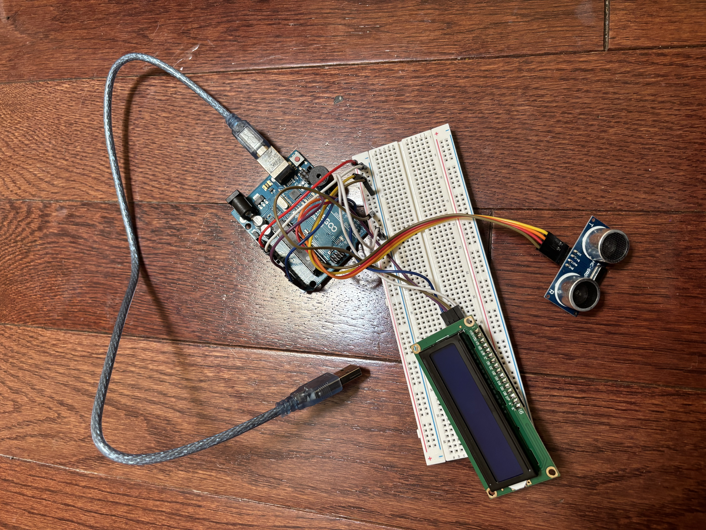
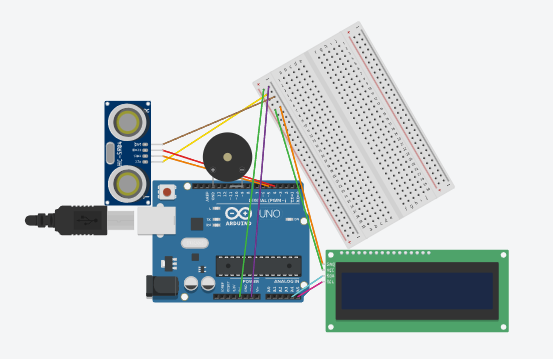

# Ultrasonic Theremin

My project plays different notes based on the distance it detects. When higher distances are detected, it plays higher frequencies of sound. I modified it to play a song at the max distance and to also display the notes of the sound playing. This project definitely required a lot of testing but it was fun to experiment with.  

| **Engineer** | **School** | **Area of Interest** | **Grade** |
|:--:|:--:|:--:|:--:|
| Yumi C | High School for Dual Language and Asian Studies | Electrical Engineering | Incoming Senior



  
# Final Milestone

<iframe width="560" height="315" src="https://www.youtube.com/embed/TFdw6m09jvU?si=PqJcUx1abOI7aAz5" title="YouTube video player" frameborder="0" allow="accelerometer; autoplay; clipboard-write; encrypted-media; gyroscope; picture-in-picture; web-share" referrerpolicy="strict-origin-when-cross-origin" allowfullscreen></iframe>

In this milestone I added two new songs which are Despacito and the Super Mario Bros theme song. I have also added a I2C LCD display that displays the notes that are being played. A challenge I faced was how to make the lcd screen display notes sequentially and fill up the screen before restarting. When testing the screen out, after the screen filled with notes, new notes kept coming in making the screen unreadable and messy. To fix this issue I added a lcd.clear code to clear the screen after it filled up. To make the new notes display from the start, I added the integer of column and row and set it to zero after lcd.clear. In addition, when trying to make the notes play sequentially I noticed that not all notes are the same length for example C4 and C#8, so to make the distance between every note at least one block, I used the longest note which is 3 blocks and added one. The code for that is column=column+4; so after a note gets displayed, the next note will have 3 blocks to display and one block as the space between it and the next note. Through this program, I learned a lot about errors in code, that projects require a lot of testing, and to use your resources.


# Second Milestone
<iframe width="560" height="315" src="https://www.youtube.com/embed/LtDD3v47ZKs?si=N-fFms3usaVw5iZ6" title="YouTube video player" frameborder="0" allow="accelerometer; autoplay; clipboard-write; encrypted-media; gyroscope; picture-in-picture; web-share" referrerpolicy="strict-origin-when-cross-origin" allowfullscreen></iframe>

In this milestone, I added modifications to my project. The modification was making the piezo buzzer play a song when the ultrasonic sensor detects the max distance. I feel like this made my project a lot more entertaining than before when it just played normal notes. So far, the piezo buzzer can play two songs. I found the melody of these songs by looking in other github projects and I picked out the main part of the melody to put in my code. The main issues I encountered in the code was when to use {} and ; and I figured it out by the new codes to old codes to see where the {} and ; placement was. I also learned that order matters because before errors kept occuring saying certain things I already defined weren't define and than I realized I defined it after I used it thats why it didn't say it was defined. To solve it, I switched the order of the two. For my next milestone, I want to make a few more changes before finalizing my project. 
 

# First Milestone
<iframe width="560" height="315" src="https://www.youtube.com/embed/Gvu_VZZnCaM?si=l0y226hM3NC3DdzU" title="YouTube video player" frameborder="0" allow="accelerometer; autoplay; clipboard-write; encrypted-media; gyroscope; picture-in-picture; web-share" referrerpolicy="strict-origin-when-cross-origin" allowfullscreen></iframe>

In this milestone, I completed the basis of the project. I connected the ultrasonic sensor and buzzer to the arduino and added the code to Arduino IDE. Now the project works. How it works is you place your hand at different distances from the ultrasonic sensor and the buzzer will play different frequencies of sound. The sounds I chose were the notes C,D,E,F,G,A,B from the C major scale and I also added a high frequency of 800hertz inside the code to make the sounds more distinguishable. The first challenge I faced was not building the hardware correctly, after I fixed that I realized the hardware wasn’t connected to the software. Though they may be fundamental steps on a project, as a beginner, these issues have taught me quite a bit in focusing on detail. The next challenge I encountered was in the code. The documentation I followed for this project has their pins set to 9 for their piezo buzzer however mine was smaller in size so it could only reach pin 11. The buzzer didn’t work because in the code the pins were still at pin 9 and after realizing and changing the pin to11, the buzzer worked. My plan for modifications is trying to make the buzzer play a short song.  


# Schematics 


# Code

```c++
#include "pitches.h"
#include <LiquidCrystal_I2C.h>
LiquidCrystal_I2C lcd(0x27, 16, 2);
String notename(int note) {
  if (note == NOTE_B0) return "B0";
  if (note == NOTE_C1) return "C1";
  if (note == NOTE_CS1) return "C#1";
  if (note == NOTE_D1) return "D1";
  if (note == NOTE_DS1) return "D#1";
  if (note == NOTE_E1) return "E1";
  if (note == NOTE_F1) return "F1";
  if (note == NOTE_FS1) return "F#1";
  if (note == NOTE_G1) return "G1";
  if (note == NOTE_GS1) return "G#1";
  if (note == NOTE_A1) return "A1";
  if (note == NOTE_AS1) return "A#1";
  if (note == NOTE_B1) return "B1";
  if (note == NOTE_C2) return "C2";
  if (note == NOTE_CS2) return "C#2";
  if (note == NOTE_D2) return "D2";
  if (note == NOTE_DS2) return "D#2";
  if (note == NOTE_E2) return "E2";
  if (note == NOTE_F2) return "F2";
  if (note == NOTE_FS2) return "F#2";
  if (note == NOTE_G2) return "G2";
  if (note == NOTE_GS2) return "G#2";
  if (note == NOTE_A2) return "A2";
  if (note == NOTE_AS2) return "A#2";
  if (note == NOTE_B2) return "B2";
  if (note == NOTE_C3) return "C3";
  if (note == NOTE_CS3) return "C#3";
  if (note == NOTE_D3) return "D3";
  if (note == NOTE_DS3) return "D#3";
  if (note == NOTE_E3) return "E3";
  if (note == NOTE_F3) return "F3";
  if (note == NOTE_FS3) return "F#3";
  if (note == NOTE_G3) return "G3";
  if (note == NOTE_GS3) return "G#3";
  if (note == NOTE_A3) return "A3";
  if (note == NOTE_AS3) return "A#3";
  if (note == NOTE_B3) return "B3";
  if (note == NOTE_C4) return "C4";
  if (note == NOTE_CS4) return "C#4";
  if (note == NOTE_D4) return "D4";
  if (note == NOTE_DS4) return "D#4";
  if (note == NOTE_E4) return "E4";
  if (note == NOTE_F4) return "F4";
  if (note == NOTE_FS4) return "F#4";
  if (note == NOTE_G4) return "G4";
  if (note == NOTE_GS4) return "G#4";
  if (note == NOTE_A4) return "A4";
  if (note == NOTE_AS4) return "A#4";
  if (note == NOTE_B4) return "B4";
  if (note == NOTE_C5) return "C5";
  if (note == NOTE_CS5) return "C#5";
  if (note == NOTE_D5) return "D5";
  if (note == NOTE_DS5) return "D#5";
  if (note == NOTE_E5) return "E5";
  if (note == NOTE_F5) return "F5";
  if (note == NOTE_FS5) return "F#5";
  if (note == NOTE_G5) return "G5";
  if (note == NOTE_GS5) return "G#5";
  if (note == NOTE_A5) return "A5";
  if (note == NOTE_AS5) return "A#5";
  if (note == NOTE_B5) return "B5";
  if (note == NOTE_C6) return "C6";
  if (note == NOTE_CS6) return "C#6";
  if (note == NOTE_D6) return "D6";
  if (note == NOTE_DS6) return "D#6";
  if (note == NOTE_E6) return "E6";
  if (note == NOTE_F6) return "F6";
  if (note == NOTE_FS6) return "F#6";
  if (note == NOTE_G6) return "G6";
  if (note == NOTE_GS6) return "G#6";
  if (note == NOTE_A6) return "A6";
  if (note == NOTE_AS6) return "A#6";
  if (note == NOTE_B6) return "B6";
  if (note == NOTE_C7) return "C7";
  if (note == NOTE_CS7) return "C#7";
  if (note == NOTE_D7) return "D7";
  if (note == NOTE_DS7) return "D#7";
  if (note == NOTE_E7) return "E7";
  if (note == NOTE_F7) return "F7";
  if (note == NOTE_FS7) return "F#7";
  if (note == NOTE_G7) return "G7";
  if (note == NOTE_GS7) return "G#7";
  if (note == NOTE_A7) return "A7";
  if (note == NOTE_AS7) return "A#7";
  if (note == NOTE_B7) return "B7";
  if (note == NOTE_C8) return "C8";
  if (note == NOTE_CS8) return "C#8";
  if (note == NOTE_D8) return "D8";
  if (note == NOTE_DS8) return "D#8";
  if (note == REST) return "R";}
const int trigger = 5;
const int echo = 4;
int tempo = 230;
const int piezo = 11;
int distance = 0;
int distanceHigh = 0;
int lengthOfScale = 0;
int note = 0;
int wholenote = (60000 * 4) / tempo;
int divider = 0, noteDuration = 0;
int column=0;
int row=0;
//C Major scale
int scale[] = {
  NOTE_C4, NOTE_D4, NOTE_E4, NOTE_F4, NOTE_G4, NOTE_A4, NOTE_B4, NOTE_C5};


void setup() {
  lcd.init();
  lcd.backlight();
  pinMode(trigger, OUTPUT);
  pinMode(echo, INPUT);
  while (millis() < 1000) {
    digitalWrite(trigger, HIGH);
    digitalWrite(trigger, LOW);
    distance = pulseIn(echo, HIGH);  }
  for (byte i = 0; i < (sizeof(scale) / sizeof(scale[0])); i++) {
    lengthOfScale += 1;  }
};

// Pink Panther theme song
//int melody[] = {
//REST,2, REST,4, REST,8, NOTE_DS4,8,
//NOTE_E4,-4, REST,8, NOTE_FS4,8, NOTE_G4,-4, REST,8, NOTE_DS4,8,
//NOTE_E4,-8, NOTE_FS4,8,  NOTE_G4,-8, NOTE_C5,8, NOTE_B4,-8, NOTE_E4,8, NOTE_G4,-8, NOTE_B4,8,
//NOTE_AS4,2, NOTE_A4,-16, NOTE_G4,-16, NOTE_E4,-16, NOTE_D4,-16,
//NOTE_E4,2, REST,4, REST,8, NOTE_DS4,4};


//RiCkroll main part ,never gunna give u up
//int melody[] = {
  //NOTE_D5, -4, NOTE_E5, -4, NOTE_A4, 4,
  //NOTE_A4, 16, NOTE_B4, 16, NOTE_D5, 16, NOTE_B4, 16,
  //NOTE_FS5, -8, NOTE_FS5, -8, NOTE_E5, -4, NOTE_A4, 16, NOTE_B4, 16, NOTE_D5, 16, NOTE_B4, 16,
  //NOTE_E5, -8, NOTE_E5, -8, NOTE_D5, -8, NOTE_CS5, 16, NOTE_B4, -8, NOTE_A4, 16, NOTE_B4, 16, NOTE_D5, 16, NOTE_B4, 16,
  //NOTE_D5, 4, NOTE_E5, 8, NOTE_CS5, -8, NOTE_B4, 16, NOTE_A4, 8, NOTE_A4, 8, NOTE_A4, 8,
  //NOTE_E5, 4, NOTE_D5, 2};
//supermariobros tempo should be 250
int melody[] = {
  NOTE_E5,8, NOTE_E5,8, REST,8, NOTE_E5,8, REST,8, NOTE_C5,8, NOTE_E5,8, 
  NOTE_G5,4, REST,4, NOTE_G4,8, REST,4, 
  NOTE_C5,-4, NOTE_G4,8, REST,4, NOTE_E4,-4, 
  NOTE_A4,4, NOTE_B4,4, NOTE_AS4,8, NOTE_A4,4,
  NOTE_G4,-8, NOTE_E5,-8, NOTE_G5,-8, NOTE_A5,4, NOTE_F5,8, NOTE_G5,8,
  REST,8, NOTE_E5,4,NOTE_C5,8, NOTE_D5,8, NOTE_B4,-4
};
 
//despaaacito tempo 100
//int melody[] = {NOTE_D5,4, NOTE_CS5,4, NOTE_B4,8, NOTE_FS4,16,
  //REST,16,
  //NOTE_FS4,16, NOTE_FS4,16, NOTE_FS4,16, NOTE_FS4,16, NOTE_FS4,16,
  //NOTE_B4,16, NOTE_B4,16, NOTE_B4,16, NOTE_B4,8,
  //NOTE_A4,16,
  //NOTE_B4,16, REST,16, REST,16,
  //NOTE_G4,16, REST,16,
  //NOTE_G4,16, NOTE_G4,16, NOTE_G4,16, NOTE_G4,16, NOTE_G4,16,
  //NOTE_B4,16, NOTE_B4,16, NOTE_B4,16, NOTE_B4,8,
  //NOTE_CS5,16, NOTE_D5,16, REST,16, REST,16,
  //NOTE_A4,16, REST,16,
  //NOTE_A4,16, NOTE_A4,16, NOTE_A4,16, NOTE_A4,16,
  //NOTE_D5,16, NOTE_CS5,16, NOTE_D5,16, NOTE_CS5,16, NOTE_D5,8,
  //NOTE_E5,16, NOTE_E5,8,
  //NOTE_CS5,8,
  //REST,16, REST,16, REST,16,
  //REST,16, REST,16};
int notes = sizeof(melody) / sizeof(melody[0]) / 2;
void pinksong() {
  for (int thisNote = 0; thisNote < notes * 2; thisNote = thisNote + 2) {
    divider = melody[thisNote + 1];
    if (divider > 0) {
      noteDuration = (wholenote) / divider;
    } else if (divider < 0) {
      noteDuration = (wholenote) / abs(divider);
      noteDuration *= 1.5;
    }
    int currentlyplaying = melody[thisNote];
    tone(piezo, melody[thisNote], noteDuration * 0.9);
    lcd.setCursor(column,row);
    lcd.print(notename(currentlyplaying));
    column=column+4;
    if (column>15&&row==0){row=1;column=0;}
    else if (row==1&&column>15){lcd.clear();
    row=0;
    column=0;}
    delay(noteDuration);
    noTone(piezo);
  }
}
void loop() {
  digitalWrite(trigger, HIGH);
  digitalWrite(trigger, LOW);
  distance = pulseIn(echo, HIGH);
  if (distance > distanceHigh) {
    distanceHigh = distance;
  }
  if (distance >= distanceHigh) {
    pinksong();
  }
  note = map(distance, 250, distanceHigh, scale[0], scale[lengthOfScale - 1]);
  for (byte j = 0; j < (lengthOfScale); j++) {
    if (note == scale[j]) {
      tone(piezo, note);
      lcd.clear();
      lcd.setCursor(0,0);
      lcd.print(notename(note));
      break;
    } else if (note > scale[j] && note < scale[j + 1]) {
      note = scale[j];
      tone(piezo, note);
      lcd.clear();
      lcd.setCursor(0,0);
      lcd.print(notename(note));
      break;
    }
  }
  delay(30);
}
```

# Bill of Materials

| **Part** | **Note** | **Price** | **Link** |
|:--:|:--:|:--:|:--:|
| Arduino UNO | Connects the piezo buzzer, ultrasonic sensor and code | $27.60 | <a href="https://www.newark.com/arduino/a000066/dev-board-atmega328-arduino-uno/dp/78T1601?COM=ref_hackster&CMP=Hackster-NA-project-b56de4-Jul-26"> Link </a> |
| Buzzer, Piezo | Releases difference frequencies of sound | $25.29 | <a href="https://www.newark.com/moflash-signalling/ae20m-24fa/buzzer-piezo-cont-90db-2-9khz/dp/15P1093?COM=ref_hackster&CMP=Hackster-NA-project-b56de4-Jul-26"> Link </a> |
| Ultrasonic Sensor - HC-SR04 (Generic) | Detects how far a objects is away from the sensor | $5.25 | <a href="https://www.sparkfun.com/ultrasonic-distance-sensor-hc-sr04.html"> Link </a> |
| Jumper wires (generic) | Used in the adruino to connect the piezo buzzer and ultrasonic sensor to pins | $3.87 | <a href="https://www.newark.com/adafruit/759/wire-gauge-28awg/dp/88W2571?COM=ref_hackster&CMP=Hackster-NA-project-b56de4-Jul-26"> Link </a> |
| LCD with I2c | Display screen  | $9.99 | <a href="https://www.amazon.com/GeeekPi-Character-Backlight-Raspberry-Electrical/dp/B07S7PJYM6/ref=sr_1_6?dib=eyJ2IjoiMSJ9.KbkFF5Phxvs3jUkctMNx9Dr8xY5EDei7_yjyLwsZEjYXDfhd02v9p2_kobaOkmLBdlTgEsoZ2g6cYayCne3H2XjnB79DkxY-HRagr8bIyI2mbBDn7Il1uVSsQnt6pZcs7YAMl5liqsPy69ezUYQfnI9LxwrmHRBGleRlADvxjslY-8ijFTQYVcNi12t-kAhoOJGyAQo_TMsUfmaV5LMiEiZlbcjrU2Ndv_7o5DwEOsg.rpPpEkPVsikq8i9E8NCMjqMjMjoGuoFYVvjgEZNhhTE&dib_tag=se&keywords=i2c+lcd+display&qid=1786042135&sr=8-6"> Link </a> |

# Other Resources/Examples
- <a href="https://github.com/robsoncouto/arduino-songs"> Resource 1 </a>
- <a href="https://www.hackster.io/pollux-labs/arduino-theremin-with-a-minor-pentatonic-b56de4"> Resource 2 </a>
- <a href="https://github.com/Cvolton/arduinoPlayDespacito/blob/master/Despacito/despacito.ino"> Resource 3 </a>
- <a href="https://www.youtube.com/watch?v=ZOllXMxLRqc&t=2s"> Resource 4 </a>
- <a href="https://docs.arduino.cc/language-reference/en/variables/data-types/string/"> Resource 5 </a>
- <a href="https://projecthub.arduino.cc/arduino_uno_guy/i2c-liquid-crystal-displays-5eb615"> Resource 6 </a>
- <a href="https://www.youtube.com/watch?v=-jiHul1kQh4"> Resource 7 </a>

