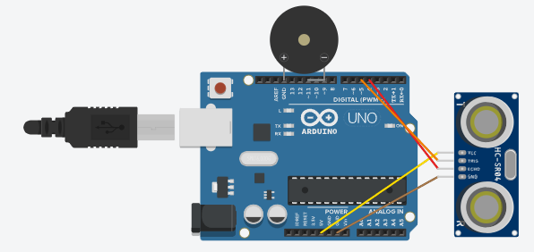
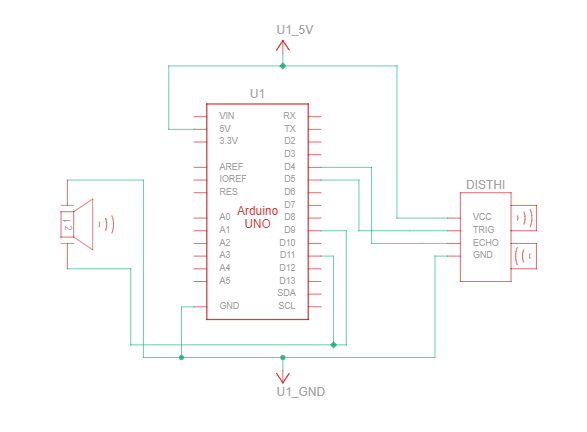

# Ultrasonic Theremin
Replace this text with a brief description (2-3 sentences) of your project. This description should draw the reader in and make them interested in what you've built. You can include what the biggest challenges, takeaways, and triumphs from completing the project were. As you complete your portfolio, remember your audience is less familiar than you are with all that your project entails!

You should comment out all portions of your portfolio that you have not completed yet, as well as any instructions:
```HTML 
<!--- This is an HTML comment in Markdown -->
<!--- Anything between these symbols will not render on the published site -->
```

| **Engineer** | **School** | **Area of Interest** | **Grade** |
|:--:|:--:|:--:|:--:|
| Yumi C | High School for Dual Language and Asian Studies | Electrical Engineering | Incoming Senior

**Replace the BlueStamp logo below with an image of yourself and your completed project. Follow the guide [here](https://tomcam.github.io/least-github-pages/adding-images-github-pages-site.html) if you need help.**


  
# Final Milestone

**Don't forget to replace the text below with the embedding for your milestone video. Go to Youtube, click Share -> Embed, and copy and paste the code to replace what's below.**

<iframe width="560" height="315" src="https://www.youtube.com/embed/y3VAmNlER5Y" title="YouTube video player" frameborder="0" allow="accelerometer; autoplay; clipboard-write; encrypted-media; gyroscope; picture-in-picture; web-share" allowfullscreen></iframe>

For your final milestone, explain the outcome of your project. Key details to include are:
- What you've accomplished since your previous milestone
- What your biggest challenges and triumphs were at BSE
- A summary of key topics you learned about
- What you hope to learn in the future after everything you've learned at BSE


# Second Milestone

**Don't forget to replace the text below with the embedding for your milestone video. Go to Youtube, click Share -> Embed, and copy and paste the code to replace what's below.**

<iframe width="560" height="315" src="https://www.youtube.com/embed/y3VAmNlER5Y" title="YouTube video player" frameborder="0" allow="accelerometer; autoplay; clipboard-write; encrypted-media; gyroscope; picture-in-picture; web-share" allowfullscreen></iframe>

For your second milestone, explain what you've worked on since your previous milestone. You can highlight:
- Technical details of what you've accomplished and how they contribute to the final goal
- What has been surprising about the project so far
- Previous challenges you faced that you overcame
- What needs to be completed before your final milestone 

# First Milestone

<iframe width="560" height="315" src="https://www.youtube.com/embed/Gvu_VZZnCaM?si=l0y226hM3NC3DdzU" title="YouTube video player" frameborder="0" allow="accelerometer; autoplay; clipboard-write; encrypted-media; gyroscope; picture-in-picture; web-share" referrerpolicy="strict-origin-when-cross-origin" allowfullscreen></iframe>

In this milestone, I completed the basis of the project. I connected the ultrasonic sensor and buzzer to the arduino and added the code to Arduino IDE. Now the project works. How it works is you place your hand at different distances from the ultrasonic sensor and the buzzer will play different frequencies of sound. The sounds I chose were the notes C,D,E,F,G,A,B from the C major scale and I also added a high frequency of 800hertz inside the code to make the sounds more distinguishable. The first challenge I faced was not building the hardware correctly, after I fixed that I realized the hardware wasn’t connected to the software. Though they may be fundamentary steps on a project, as a beginner, these issues have taught me quite a bit in focusing on detail. The next challenge I encountered was in the code. The documentation I followed for this project has their pins set to 9 for their piezo buzzer however mine was smaller in size so it could only reach pin 11. The buzzer didn’t work because in the code the pins were still at pin 9 and after realizing and changing the pin to11, the buzzer worked. My plan for modifications is trying to make the buzzer play a short song.  


# Schematics 

 

# Code
Here's where you'll put your code. The syntax below places it into a block of code. Follow the guide [here]([url](https://www.markdownguide.org/extended-syntax/)) to learn how to customize it to your project needs. 

```c++
#define NOTE_B0  31
#define NOTE_C1  33
#define NOTE_CS1 35
#define NOTE_D1  37
#define NOTE_DS1 39
#define NOTE_E1  41
#define NOTE_F1  44
#define NOTE_FS1 46
#define NOTE_G1  49
#define NOTE_GS1 52
#define NOTE_A1  55
#define NOTE_AS1 58
#define NOTE_B1  62
#define NOTE_C2  65
#define NOTE_CS2 69
#define NOTE_D2  73
#define NOTE_DS2 78
#define NOTE_E2  82
#define NOTE_F2  87
#define NOTE_FS2 93
#define NOTE_G2  98
#define NOTE_GS2 104
#define NOTE_A2  110
#define NOTE_AS2 117
#define NOTE_B2  123
#define NOTE_C3  131
#define NOTE_CS3 139
#define NOTE_D3  147
#define NOTE_DS3 156
#define NOTE_E3  165
#define NOTE_F3  175
#define NOTE_FS3 185
#define NOTE_G3  196
#define NOTE_GS3 208
#define NOTE_A3  220
#define NOTE_AS3 233
#define NOTE_B3  247
#define NOTE_C4  262
#define NOTE_CS4 277
#define NOTE_D4  294
#define NOTE_DS4 311
#define NOTE_E4  330
#define NOTE_F4  349
#define NOTE_FS4 370
#define NOTE_G4  392
#define NOTE_GS4 415
#define NOTE_A4  440
#define NOTE_AS4 466
#define NOTE_B4  494
#define NOTE_C5  523
#define NOTE_CS5 554
#define NOTE_D5  587
#define NOTE_DS5 622
#define NOTE_E5  659
#define NOTE_F5  698
#define NOTE_FS5 740
#define NOTE_G5  784
#define NOTE_GS5 831
#define NOTE_A5  880
#define NOTE_AS5 932
#define NOTE_B5  988
#define NOTE_C6  1047
#define NOTE_CS6 1109
#define NOTE_D6  1175
#define NOTE_DS6 1245
#define NOTE_E6  1319
#define NOTE_F6  1397
#define NOTE_FS6 1480
#define NOTE_G6  1568
#define NOTE_GS6 1661
#define NOTE_A6  1760
#define NOTE_AS6 1865
#define NOTE_B6  1976
#define NOTE_C7  2093
#define NOTE_CS7 2217
#define NOTE_D7  2349
#define NOTE_DS7 2489
#define NOTE_E7  2637
#define NOTE_F7  2794
#define NOTE_FS7 2960
#define NOTE_G7  3136
#define NOTE_GS7 3322
#define NOTE_A7  3520
#define NOTE_AS7 3729
#define NOTE_B7  3951
#define NOTE_C8  4186
#define NOTE_CS8 4435
#define NOTE_D8  4699
#define NOTE_DS8 4978
#define REST 0


const int trigger = 5;
const int echo = 4;
int tempo = 120;

const int piezo = 11;


int distance = 0;
int distanceHigh = 0;


int lengthOfScale = 0;


int note = 0;

int wholenote = (60000 * 4) / tempo;
int divider = 0, noteDuration = 0;


//C Major scale
int scale[] = {
  262, 294, 330, 349, 392, 440, 494, 800
};


void setup() {
  pinMode(trigger, OUTPUT);
  pinMode(echo, INPUT);


  while (millis() < 1000) {
    digitalWrite(trigger, HIGH);
    digitalWrite(trigger, LOW);
    distance = pulseIn(echo, HIGH);
  }


  for (byte i = 0; i < (sizeof(scale) / sizeof(scale[0])); i++) {
    lengthOfScale += 1;
  }
};

  // Pink Panther theme song
int melody[] = {
  REST,2, REST,4, REST,8, NOTE_DS4,8, 
  NOTE_E4,-4, REST,8, NOTE_FS4,8, NOTE_G4,-4, REST,8, NOTE_DS4,8,
  NOTE_E4,-8, NOTE_FS4,8,  NOTE_G4,-8, NOTE_C5,8, NOTE_B4,-8, NOTE_E4,8, NOTE_G4,-8, NOTE_B4,8,   
  NOTE_AS4,2, NOTE_A4,-16, NOTE_G4,-16, NOTE_E4,-16, NOTE_D4,-16, 
  NOTE_E4,2, REST,4, REST,8, NOTE_DS4,4};

 //RiCkroll main part ,never gunna give u up
//int melody[] = {
//REST,4, NOTE_B4,8, NOTE_CS5,8, NOTE_D5,8, NOTE_D5,8, NOTE_E5,8, NOTE_CS5,-8,
  //NOTE_B4,16, NOTE_A4,2, REST,4,REST,8, NOTE_B4,8, NOTE_B4,8, NOTE_CS5,8, //NOTE_D5,8, NOTE_B4,4, NOTE_A4,8, //7
  ///NOTE_A5,8, REST,8, NOTE_A5,8, NOTE_E5,-4, REST,4};


int notes = sizeof(melody) / sizeof(melody[0]) / 2;

  void pinksong(){
  
    for (int thisNote = 0; thisNote < notes * 2; thisNote = thisNote + 2) 
    {divider = melody[thisNote + 1];
    
    if (divider > 0) {
      noteDuration = (wholenote) / divider;}
    else if(divider < 0) {
      noteDuration = (wholenote) / abs(divider);
      noteDuration *= 1.5;
    }
      tone(piezo, melody[thisNote], noteDuration * 0.9);
     delay(noteDuration);
     noTone(piezo);
   }
}


void loop() {
  digitalWrite(trigger, HIGH);
  digitalWrite(trigger, LOW);
  distance = pulseIn(echo, HIGH);

    if (distance > distanceHigh) {
      distanceHigh = distance;}
  if (distance >= distanceHigh) {
      pinksong();} 
    
  note = map(distance, 250, distanceHigh, scale[0], scale[lengthOfScale - 1]);

  for (byte j = 0; j < (lengthOfScale); j++) {

    if (note == scale[j]) {
      tone(piezo, note);
      break;
    }
    else if (note > scale[j] && note < scale[j + 1]) {
      note = scale[j];
      tone(piezo, note);
      break;
    }
  }
  delay(30);
  }

```

# Bill of Materials
Here's where you'll list the parts in your project. To add more rows, just copy and paste the example rows below.
Don't forget to place the link of where to buy each component inside the quotation marks in the corresponding row after href =. Follow the guide [here]([url](https://www.markdownguide.org/extended-syntax/)) to learn how to customize this to your project needs. 

| **Part** | **Note** | **Price** | **Link** |
|:--:|:--:|:--:|:--:|
| Arduino UNO | Connects the piezo buzzer, ultrasonic sensor and code | $27.60 | <a href="https://www.newark.com/arduino/a000066/dev-board-atmega328-arduino-uno/dp/78T1601?COM=ref_hackster&CMP=Hackster-NA-project-b56de4-Jul-26"> Link </a> |
| Buzzer, Piezo | Releases difference frequencies of sound | $25.29 | <a href="https://www.newark.com/moflash-signalling/ae20m-24fa/buzzer-piezo-cont-90db-2-9khz/dp/15P1093?COM=ref_hackster&CMP=Hackster-NA-project-b56de4-Jul-26"> Link </a> |
| Ultrasonic Sensor - HC-SR04 (Generic) | Detects how far a objects is away from the sensor | $5.25 | <a href="https://www.sparkfun.com/ultrasonic-distance-sensor-hc-sr04.html"> Link </a> |
| Jumper wires (generic) | Used in the adruino to connect the piezo buzzer and ultrasonic sensor to pins | $3.87 | <a href="https://www.newark.com/adafruit/759/wire-gauge-28awg/dp/88W2571?COM=ref_hackster&CMP=Hackster-NA-project-b56de4-Jul-26"> Link </a> |

# Other Resources/Examples
One of the best parts about Github is that you can view how other people set up their own work. Here are some past BSE portfolios that are awesome examples. You can view how they set up their portfolio, and you can view their index.md files to understand how they implemented different portfolio components.
- [Example 1](https://trashytuber.github.io/YimingJiaBlueStamp/)
- [Example 2](https://sviatil0.github.io/Sviatoslav_BSE/)
- [Example 3](https://arneshkumar.github.io/arneshbluestamp/)

To watch the BSE tutorial on how to create a portfolio, click here.
